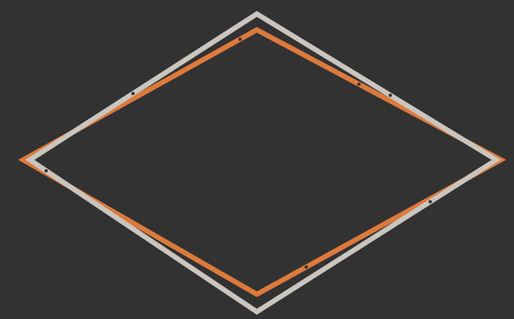

# Abstract Calendar
## Sketch
- Each edge will grow from the center of the image to the edge.
- Each edge represets a different value.
- Top = Day
- Right = Week
- Bottom = Month
- Left = Year
## Final Design

### Changes to Initial Design
The original design was implemented with the following improvements & additions: 
- Color of the original shape changes to present the seasons.
- A small call is added to each edge to give an alternative way of showing the progress of a time period.
- An additional shape with progress balls is added that represents a clock. The colors fade between day and night.

