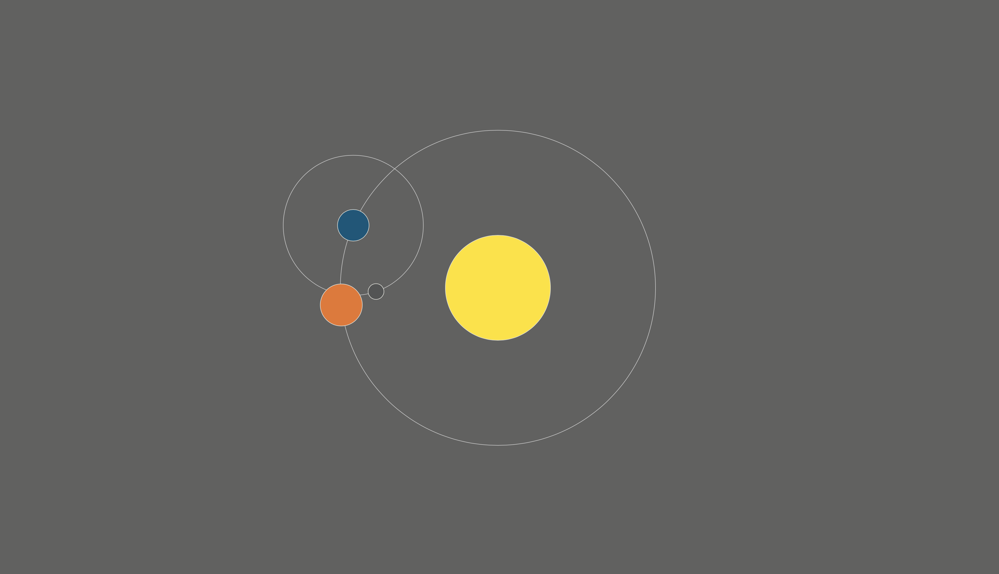

# Orbit Calendar
## Sketch
- One rotation of the blue cirlcearound the yellow cirlce = 1 year
- One rotation of the grey circle around the blue circle = 1 day
- Change in colour of the blue circle to a dark grey = change from day and night

## Final Design

### Changes from initial Design
The implentation was true to the original sketch with a few additions
- A 3rd oribiting cirle is added that will rotate once in a year
- The new circle color will fade between different colors throughout the year to represent seasons.
- Each circle now orbits at faster speeds to accomodate the introduction of the 3rd orbiting circle.

