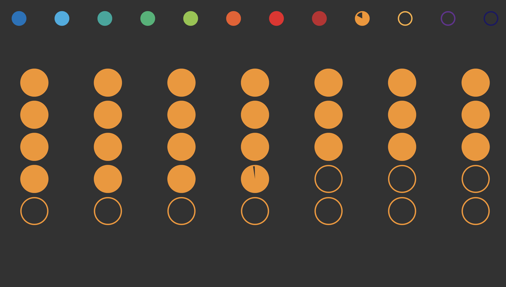

# Pie Chart Calendar
## Sketch
- 12 Small circles represeting each month
- Each colour related to the season
- Each circle is a pie chart representing the progress through the month
- Larger cirlcles are days formatted in weekly rows
- Grey cirlces are days not within the month
- While circles are days in the month not yetr completed
- Colored cirlces (based on the month color) are completed days
- Pie chart for progress through each day
## Final Design

### Changes from initial design
The implementation is almost idenitcal to the original sketch with two changes based on feedback.  
- Pie chart colors fade between the assigned month colors as the month progresses.
- Pie charts all start on the upper left circle.
