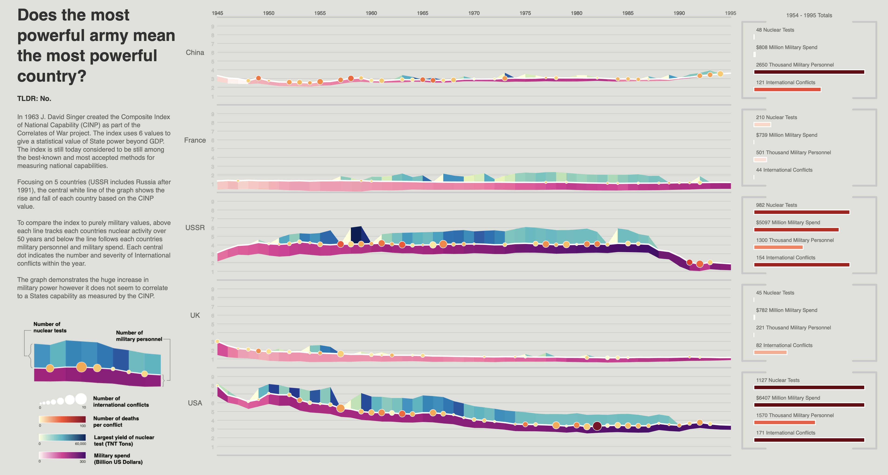
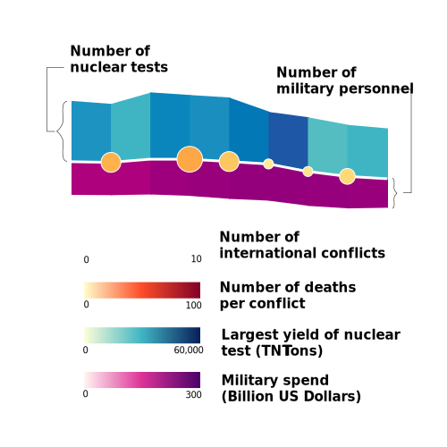
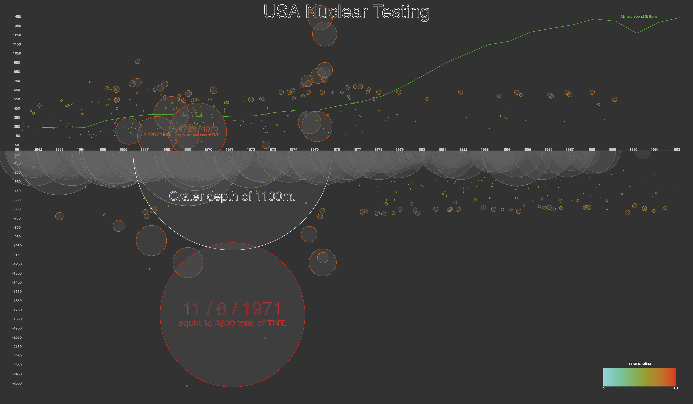
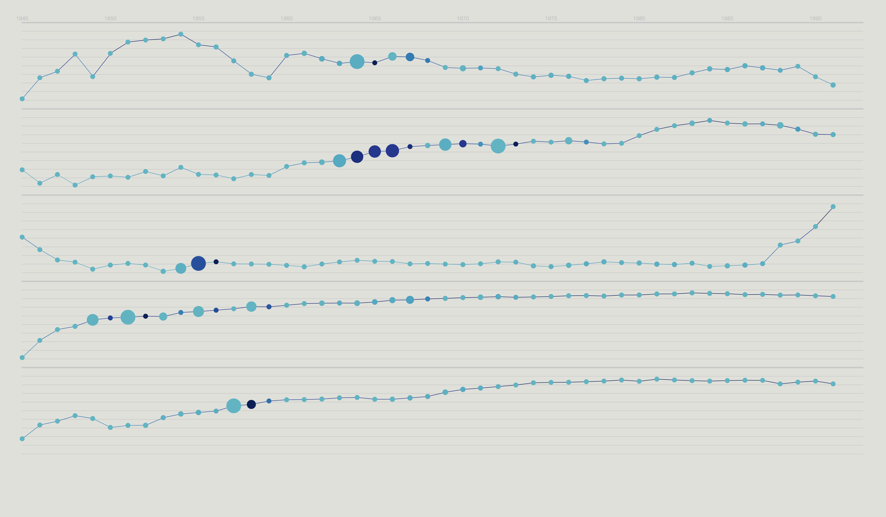
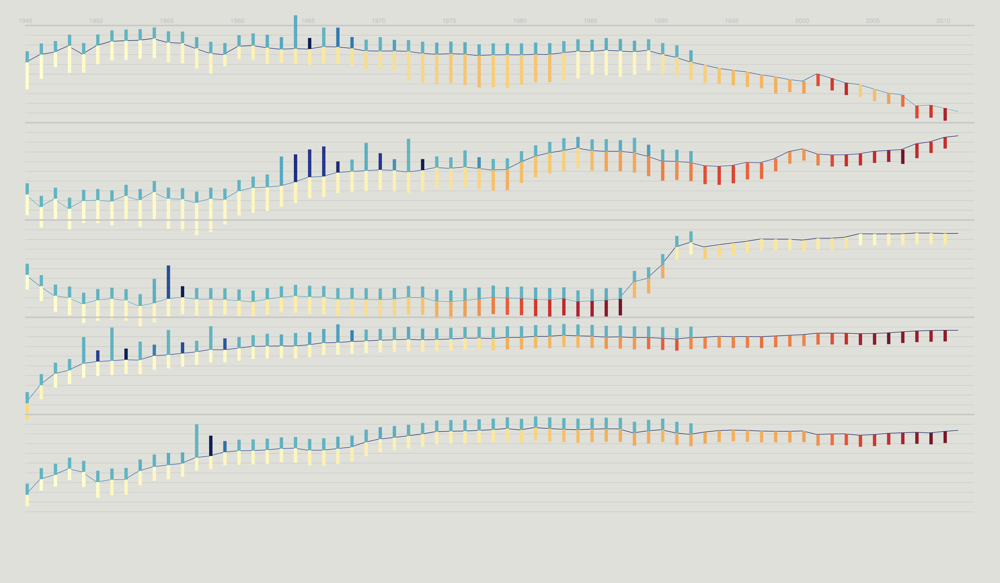
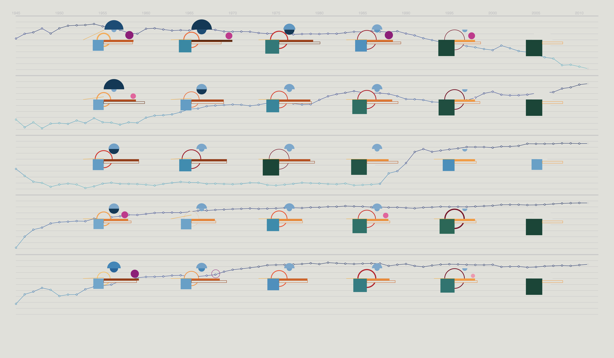

# Final Mapping Quantities Project
## Does the most powerful army make the most powerful country?
*In 1963 J. David Singer created the Composite Index of National Capability (CINP) as part of the [Correlates of War project](http://www.correlatesofwar.org). The index uses 6 values to give a statistical value of state power beyond GDP. The index is still today considered to be still among the best-known and most accepted methods for measuring national capabilities [[source](https://web.archive.org/web/20110626235023/http://www.giga-hamburg.de/english/content/rpn/strategy/pdf/power_index.pdf)].*

This visualization focusing on 5 countries, comparing the CINP value against miilitary measures includes spend, size, nuclear testing and international conflicts.

  

All values in the main graph except the CINP value are mapped to a [logarithmic scale](https://en.wikipedia.org/wiki/Logarithmic_scale). This allows comparisons between both time and country although absolute values are harder to deduct. The finals section on the right hand side of the visualization uses are linear scale that allows direct comparisons of absolute values between the countries.  

## Previous Concepts and Progress
### Original Design
  
### Process to Final Design
  
  
  
