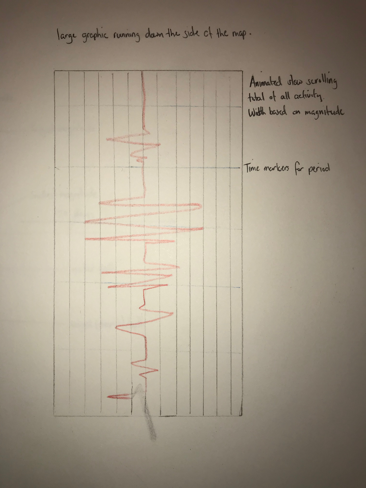

## Process

# Designs
### Design 1
Tooltip design to show frequency of earthquakes within a given area.  
Earthquakes will be shown in real time (on csv refresh every minute) by circle indicator. Size representative of magnitude and color fades over time. 

### Design 2
Comparison of highest, lowest & average magnitude & depth of earthquakes for each day over a month period.

### Design 3
Classic seimometer design showing the total magnitude for each time period (could change time period using drop down menu).

# Tile Designs
Mapbox light and dark themes would minimise the distraction of other map features and focus on overlayed detail. Overlays that include population or population density would be interesting to see where the eathquakes could potentially cause more of an issue. 

