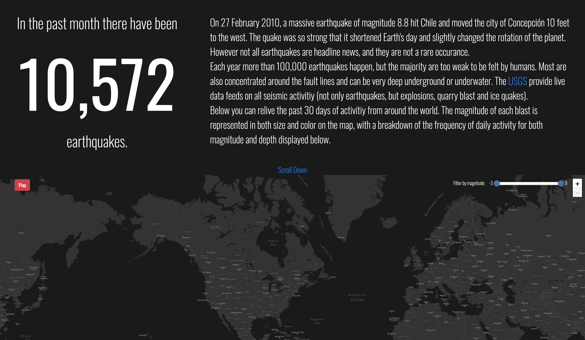
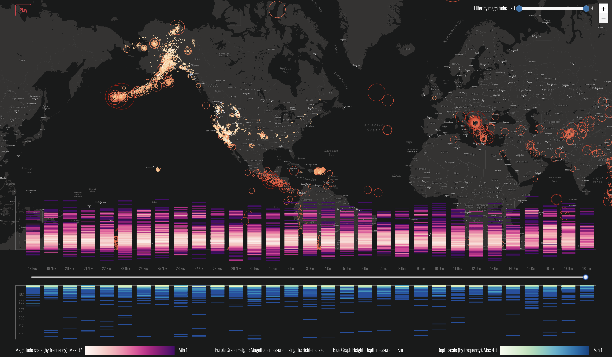
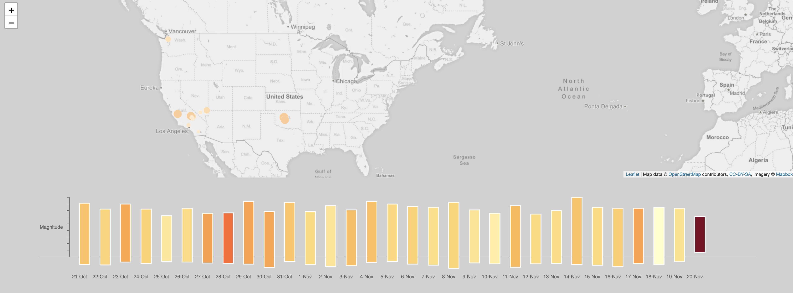
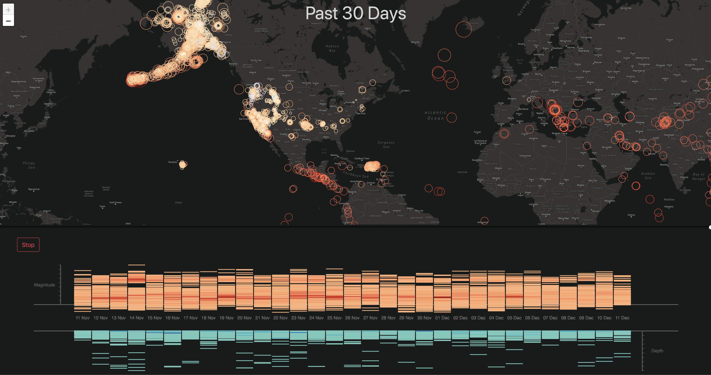

# Mapping Space Final Design
An interactive visualization that uses the live USGS data feed to display the past 30 days of seismic activity. 
## Map
- The map portion shows the location and magnitude (through size and color), and focuses on more significant earthqakes by keeping them displayed for longer (on the playback mode).
- Additional colors are used to display different types of activity including ice quakes and quarry blasts. 
- A tool tip can be displayed for each explosion showing details of the location, time, magntiude, nearest city and depth. 
## Graph
- The associated graph breaks down the earthquakes into individual days and displays both their magnitude and depth on a scale. Color is used as a 'heat map' to show which magntiude and depth moth earthqakes happen at. 
## Interactivity
- The play button displays the earthquakes in chronological order at a rate of 1 second to each day. At the end of the animation, all earthquakes are displayed. The user can stop and play the animation or slide the timetime to visualise any point in time. 
- In addition to being able to see all earthquakes over the past 30 days (usually over 10,000) the user can optionally select a range of magnitudes to display.

## Process
These are a few screenshots of the process leading to the final design, showing color changes, different scales and not displaying individual points on the graph. 

